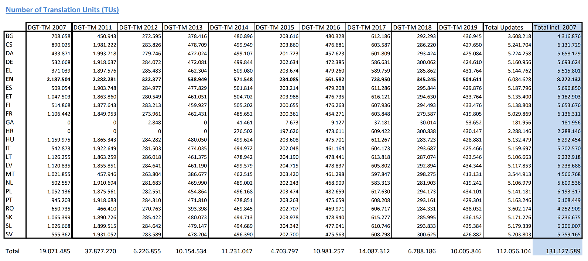

# tmxtract 🗺

My goal with this it is to make easier for people trying to train their own machine translator and hopefully with that help more people to offer their content to a larger audience 🗺🌟

## Purpose 💡

This tool is designed to help you to create a basic TMX to bootstrap your translation efforts.
The [tmx files]() can be useful in different situations to train a machine translator.

One of the biggest challenges when training a machine translation model is to get good quality source data. In order to help with that, you can make use of publicly available sources.

## How to use it 👌

To use it simply download one of the releases to your OS

them to execute you run

```sh
tmxtract -s <source-languge> -d <destiation-language>
```

## Parameters

```txt
Usage: tmxtract [options]

Options:
  -?|-h|--help               Show help information
  --download-folder          Where to download the DGT Files
  -s|--source-language       Language to translate from ex: EN-GB
  -d|--destination-language  Language that you want to translate to ex: ES-ES
  -f|--output-file           Output file
  -n|--max-translations      Number of translations to generate default:100000
  -l|--language-map          Map of languages to be replaced in the resulting doc can be used multiple times Ex: -l ES-ES:es -l EN-UK:en
  -i|--max-doc-id-size       Maximum size for the id of a document
```

## Using it from Source 💻

### Pre-Requisits

- .net core >= 2.2
- c# >= 7.1 (for the async maind method)

## Downloading and executing 💾

On the command line clone the repository and restore and run 😊

It is important to include the basic parameters needed to export

```bash
git clone https://github.com/Nepomuceno/tmxtract.git
cd tmxtract/src/tmxtract
dotnet restore
dotnet run -s ES-ES -d EN-GB
```

## Data Source

In this tool I am using [DGT-Translation Memory](https://ec.europa.eu/jrc/en/language-technologies/dgt-translation-memory) from the [European Comission](https://ec.europa.eu/commission/index_en) it is a corpus of professionally translated text in more than 22 languages


